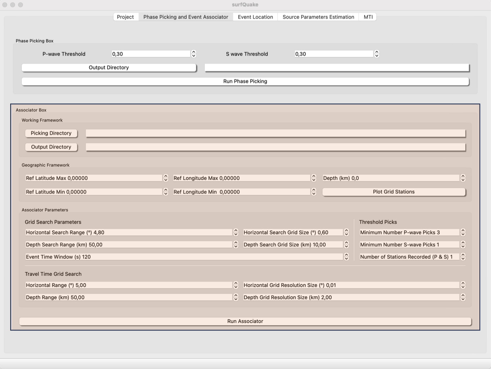

# Arraival times Assocotiation
The main goal of this tool is to associate the arrival times of different P- and S-waves to the their corresponding events. The associator algorythm used in surfquake is REAL ([<span style="color:#5DADE2;">Zhang et al., 2019</span>](https://github.com/Dal-mzhang/REAL/)). The user needs to set the input parameters and point to the folder where the picks have been storaged. In th following sections it will be describe the surfquake imprementation of REAL, for a full description of the parameters visit [<span style="color:#5DADE2;">REAL cookbook</span>](https://github.com/Dal-mzhang/REAL/blob/master/REAL_userguide_July2021.pdf
)


## Events Associator GUI

This is a screenshot of the Associator GUI.



The basics settings to associate inside a medium size region (300 x 300) km are show in the upper screenshot.

- Picking Directory: Root path to the folders containing the picking files. This files are automatically generated after running the picking tool.
- Output Directory: Path to the forlder where the users wants the results of the arrival times association. Picking file <span style="color:blue">nll_input.txt</span> to Event Locaion tool will be also saved in this folder.

- Geographic Framework: Set the coordinates of your study region and remind loading the metadata from project tool. You can plot a map to be sure tour settings are ok.
- Associator Parameters: These parameters are described in this [link](https://github.com/Dal-mzhang/REAL/blob/master/REAL_userguide_July2021.pdf).

## Config files
The parametrization of the Event Assocciator tool can be storaged in a file.ini. An example of this file is as follows:

```
[GEOGRAPHIC_FRAME]
LAT_REF_MAX = 43.0000
LAT_REF_MIN = 42.0000
LON_REF_MIN = 0.8000
LON_REF_MAX = 2.2000
DEPTH = 20.00
#
[GRID_SEARCH_PARAMETERS]
HORIZONTAL_SEARCH_RANGE = 4.80
DEPTH_SEARCH_RANGE = 50.00
EVENT_TIME_WINDOW = 120.00
HORIZONTAL_SEARCH_GRID_SIZE = 0.60
DEPTH_SEARCH_GRID_SIZE = 10.00
#
[TRAVEL_TIME_GRID_SEARCH]
HORIZONTAL_RANGE = 5.00
DEPTH_RANGE = 50.00
DEPTH_GRID_RESOLUTION_SIZE = 2.00
HORIZONTAL_GRID_RESOLUTION_SIZE = 0.01
#
[THRESHOLD_PICKS]
MIN_NUM_P_WAVE_PICKS = 3
MIN_NUM_S_WAVE_PICKS = 1
NUM_STATIONS_RECORDED = 1
```
The performance of REAL depends critically on parameter tuning. These parameters control:
1) Search geometry
2) Grid resolution
3) Time tolerance
4) Pick thresholds

## Parametrization Details

The parameters in the configuration file define the geographic limits of the study area, the search volume used by REAL, the resolution of the travel-time grid, and the minimum number of picks required to accept an association. A good configuration should cover the target region and the seismic network while avoiding search windows that are unnecessarily large.

### Geographic frame

The `GEOGRAPHIC_FRAME` section defines the spatial limits used by the associator.

- `LAT_REF_MAX` / `LAT_REF_MIN`: Maximum and minimum latitude of the study area.
- `LON_REF_MAX` / `LON_REF_MIN`: Maximum and minimum longitude of the study area.
- `DEPTH`: Maximum depth, in kilometres, considered during the association.

The geographic frame should include the complete station network and the expected seismicity area. It is recommended to add a small margin around the network, usually around `0.5–1.0°`. If the area is too large, REAL can generate more false associations. If it is too small, events located close to the borders may be missed.

### Grid search parameters

The `GRID_SEARCH_PARAMETERS` section controls the event search volume and the time window used to group picks.

- `HORIZONTAL_SEARCH_RANGE`: Horizontal distance, in degrees, used during the event search.
- `DEPTH_SEARCH_RANGE`: Maximum depth range, in kilometres, used during the event search.
- `EVENT_TIME_WINDOW`: Time window, in seconds, used to associate picks that may belong to the same event.
- `HORIZONTAL_SEARCH_GRID_SIZE`: Horizontal spacing, in degrees, of the search grid.
- `DEPTH_SEARCH_GRID_SIZE`: Vertical spacing, in kilometres, of the search grid.

As a general rule, the horizontal search range should be larger than twice the average station spacing. Dense networks can usually work with values around `0.5–1.0°`, medium-density networks with `1–2°`, and sparse networks with `2–4°`.

The grid size defines the precision and computational cost of the search. Smaller values improve the resolution but increase the execution time. Typical values for `HORIZONTAL_SEARCH_GRID_SIZE` are `0.02–0.05°` for production runs and `0.05–0.1°` for testing. Values larger than `0.2°` should normally be avoided. For `DEPTH_SEARCH_GRID_SIZE`, common values are `2–5 km`.

The `EVENT_TIME_WINDOW` should be adapted to the seismicity rate. Low-seismicity regions can use wider windows, such as `90–120 s`. For swarms or regions with many close events, shorter windows, such as `30–60 s`, usually reduce false associations.

### Travel-time grid search

The `TRAVEL_TIME_GRID_SEARCH` section defines the grid used to compute and store travel times.

- `HORIZONTAL_RANGE`: Maximum horizontal distance, in degrees, covered by the travel-time grid.
- `DEPTH_RANGE`: Maximum depth, in kilometres, covered by the travel-time grid.
- `HORIZONTAL_GRID_RESOLUTION_SIZE`: Horizontal resolution, in degrees, of the travel-time grid.
- `DEPTH_GRID_RESOLUTION_SIZE`: Depth resolution, in kilometres, of the travel-time grid.

The travel-time grid must cover the maximum expected distance between stations and possible events. It is recommended to add a margin of approximately `20–30%`. If the travel-time grid is too small, REAL may not associate any events. Typical resolution values are `0.01°` horizontally and `1–2 km` in depth.

### Pick thresholds

The `THRESHOLD_PICKS` section defines the minimum number of observations required to accept an event candidate.

- `MIN_NUM_P_WAVE_PICKS`: Minimum number of P-wave picks required.
- `MIN_NUM_S_WAVE_PICKS`: Minimum number of S-wave picks required.
- `NUM_STATIONS_RECORDED`: Minimum number of stations that must record the event.

For small networks with `5–8` stations, a good starting value for `MIN_NUM_P_WAVE_PICKS` is usually `2–3`. For networks with `10–15` stations, values around `3–4` are commonly used. The `MIN_NUM_S_WAVE_PICKS` parameter can initially be set to `0` and increased later if S-wave picks are reliable. For `NUM_STATIONS_RECORDED`, dense networks can use `3–5`, while sparse networks may require `2–3`.

### Parameter interactions

The parameters should be tuned together rather than independently. Large search ranges combined with wide time windows can increase the number of false associations. Smaller grid sizes improve precision but increase computation time. Narrow search ranges and short time windows reduce noise, but they can also miss events if the expected event location or origin time is not well constrained.

A practical workflow is to begin with permissive values, inspect the resulting associations, and then progressively tighten the thresholds, search ranges, and time windows until the number of false associations is reduced without losing valid events.

## Events Associator from CLI

### Usage
```bash
>> surfquake associate [-h] -i INVENTORY_FILE_PATH -p DATA_DIR -c CONFIG_FILE_PATH -w WORK_DIR_PATH -s SAVE_DIR [-v]
``` 
### Interactive help

```bash
>> surfquake associate -h
``` 

### Run Phase Picker from CLI

```bash
>> surfquake associate -i /surfquake_test/metadata/inv_all.xml -p /surfquake_test/test_picking_final -c /surfquake_test/config_files/real_config.ini
```

## Events Associator from Library
### Classes
[`RealCore`](https://github.com/rcabdia/SurfQuakeCore/blob/main/surfquakecore/real/real_core.py)

```python
class RealCore:
    def __init__(self, metadata_file: str, real_config: Union[str, RealConfig], picking_directory: str, working_directory: str,
                 output_directory: str):

        """
        ----------
        Parameters
        ----------
        metadata_file str: Path to the inventory information of stations coordinates and instrument description
        real_config: Either the path to a real_config.ini or a RealConfig object.
        picking_directory str: Root path to the folder wher picks P and S wave arrival time picks are storage
        working_directory str: Root path to the folder that the associator uses to save intermediate files sucha as travel-times.
        """

```

### Methods

[`run_real`](https://github.com/rcabdia/SurfQuakeCore/blob/main/surfquakecore/real/real_core.py)

```python
# instance method
def run_real(self):
    # starts the events associator
```

### example using library

```python linenums="1"
from surfquakecore.real.real_core import RealCore

# Inventory Information
inventory_path = "/meta/inv_all.xml"

# picking Output of PhaseNet
picks_path = '/test_surfquake_core/picks'

# Set working_directory and output
working_directory = '/test_surfquake_core/test_real/working_directory'
output_directory = '/test_surfquake_core/test_real/output_directory'

# Set path to REAL configuration
config_path = surfquake_test/config_files/real_config.ini
# Run association
rc = RealCore(inventory_path, config_path, picks_path, working_directory, output_directory)
rc.run_real()
print("End of Events AssociationProcess, please see for results: ", output_directory)
```