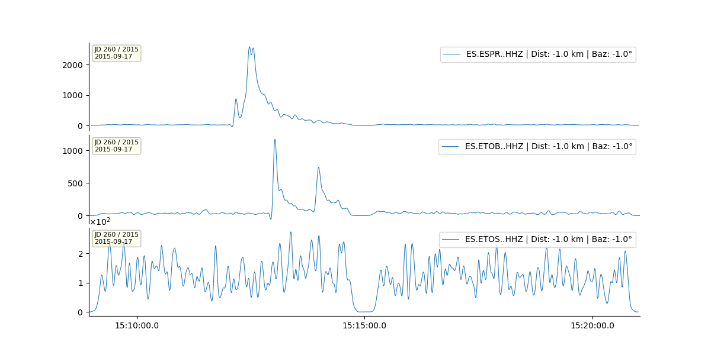

# Characteristic Functions in SurfQuake

Characteristic Functions (CFs) are core tools in seismic signal processing used to detect and quantify features like onset, amplitude, or signal clarity. SurfQuake supports three main CFs as part of its processing stack: **Signal-to-Noise Ratio (SNR)**, **Envelope**, **Spectral Entropy** and **Kurtosis**. Each of these functions enhances interpretability and supports tasks like phase picking, event detection, and signal classification.

---

## 1. Signal-to-Noise Ratio (SNR)

This method measures how prominent a signal is relative to background noise, typically over short- and long-term averaging windows.

### Supported Methods

- **classic**: Uses the classic STA/LTA (Short-Term Average / Long-Term Average) ratio  
  ([Allen, 1978](https://doi.org/10.1029/JB083iB08p03585))
- **recursive**: Applies a recursive version of STA/LTA for computational efficiency  
- **z_detect**: Implements a simplified z-score detector

### Parameters

- `sign_win`: Short-term window (seconds)
- `noise_win`: Long-term window (seconds)

### Config Example

```yaml
Analysis:
  process_1:
    name: 'concat'
  process_2:
    name: 'rmean'
    method: 'linear'
  process_3:
    name: 'taper'
    method: 'cosine'
    max_percentage: 0.05
  process_4:
    name: 'filter'
    type: 'bandpass'
    fmin: 0.5
    fmax: 8.0
    corners: 4
    zerophase: True
  process_1:
    name: 'snr'
    method: 'classic'
    sign_win: 1
    noise_win: 40
```

---

## 2. Envelope

The envelope of a seismic trace provides a smooth representation of amplitude over time, often used for locating energy bursts and improving event visibility.

### Methods

- **FULL** (default): Uses the analytic signal (Hilbert transform) to compute the full envelope.
- **SMOOTH**: Optionally applies lowpass filtering after envelope extraction.

### Parameters

- `method`: `'FULL'` or `'SMOOTH'`
- `corner_freq`: Lowpass filter cutoff (only for `'SMOOTH'`)

### Config Example

```yaml
Analysis:
  process_1:
    name: 'concat'
  process_2:
    name: 'rmean'
    method: 'linear'
  process_3:
    name: 'taper'
    method: 'cosine'
    max_percentage: 0.05
  process_4:
    name: 'filter'
    type: 'bandpass'
    fmin: 0.5
    fmax: 8.0
    corners: 4
    zerophase: True
  process_5:
    name: 'envelope'
    method: 'SMOOTH'
    corner_freq: 0.15
```

### Reference

- Kanasewich, E. R. (1981). *Time Sequence Analysis in Geophysics*.

---

## 3. Spectral Entropy

Spectral entropy quantifies the disorder in the frequency content of a seismic trace over time. High entropy indicates noise or dispersed signals, while low entropy points to coherent, narrowband energy.

### Parameters

- `win`: Window length in seconds (default: 2.0)
- `overlap`: Overlap between windows as a fraction (0.0–1.0)
- `normalize`: Normalize entropy values between 0 and 1

### Config Example

```yaml
Analysis:
  process_1:
    name: 'entropy'
    win: 2.0
    overlap: 0.5
```

### Reference

- Ince, T., & Togneri, R. (2007). A new spectral entropy feature for seismic event detection. *Digital Signal Processing*, 17(3), 675–689.

---


## 3. Kurtosis

The CF kurtosis is considered one of the best detector. The signal is filtered with a bank of overlapping narrow band filters and the the kurtosis is computed in sliding windows.

### Parameters

- `CF_decay_win`: Window length in seconds, smaller (e.g., 2) improves detection but noiser CFs
- `fmin`: min frequency for narrow band filter bank
- `fmax`: max frequency for narrow band filter bank

### Config Example

```yaml
Analysis:
  process_1:
    name: 'kurtosis'
    CF_decay_win: 4.0
    fmin: 0.5
    fmax: 8.5
```

### Reference

-  Poiata, N., C. Satriano, J.-P. Vilotte, P. Bernard, and K. Obara (2016). **Multi-band array detection and location of seismic sources recorded by dense seismic networks**, Geophys. J. Int., 205(3), 1548-1573, doi:10.1093/gji/ggw071.


## Applications

- **SNR**: Event detection, onset detection, phase picking
- **Envelope**: Characterizing energy bursts, highlighting surface waves
- **Spectral Entropy**: Identifying coherent signals vs. noise, triggering logic
- **Kurtosis**: Detectect phases onset in very noise contaminated signals

These functions can be used as standalone processors or in combination with pickers, visualizations, or further classification models.

---

## Output

Each CF modifies the trace data to represent the calculated function. These modified traces can then be plotted, further processed, or used as features in detection algorithms.


1. **Filtered seismograms**: bandpass [0.5-8.0] Hz


2. **SNR**: Classic sta/lta (1/40)s


3. **Envelope**: Envelope and then smoothing with a lowpass filter of 0.15 Hz



4. **Kurtosis**: Kurtosis wit fmin and fmax 0.5 and 8-0 Hz and CF_decay_win of 4.0


