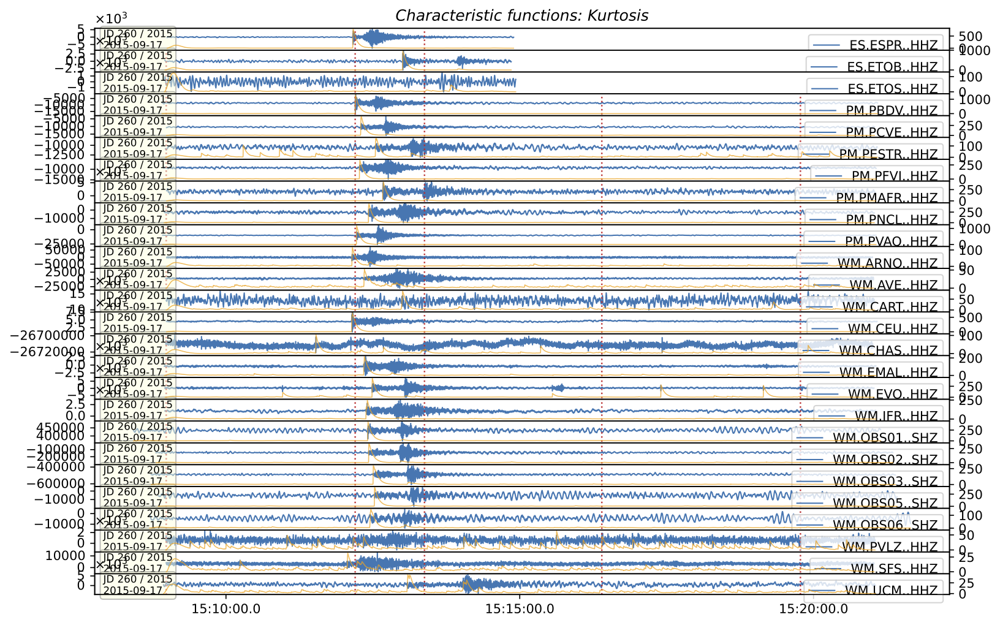

# <span style="color:darkcyan;">**Overview**</span>

Coincidence Trigger proceess input wavefroms to surrogate it as Charachteristic Functions. Then, associate CFs threshold in time spans to events. It is very useful to roughtly detect event time and separate picks for those events. surfQuake offer a coincidence trigger tool that uses signal-to-noise ratio and kurtosis CFs. The core of the coincidence trigger can be also found here [ObsPy](https://docs.obspy.org/packages/autogen/obspy.signal.trigger.coincidence_trigger.html)

References:
```
        Allen, R. (1982). Automatic phase pickers: Their present use and future prospects. Bulletin of the Seismological Society of America, 72(6B), S225-S242.

        Poiata, N., C. Satriano, J.-P. Vilotte, P. Bernard, and K. Obara (2016). Multi-band array detection and 
        location of seismic sources recorded by dense seismic networks, Geophys. J. Int.,
        205(3), 1548-1573, doi:10.1093/gji/ggw071.
```

---

## <span style="color:darkcyan;"> **Coincidence Trigger from CLI** </span>

The command **trigg** runs the coincidence trigger. It is important to set the config.ini file to determine the methodoly and the parametrization. Let's see it.

### Config file

This config.ini is used for setting the coincidence trigger for a regional event scenario. Be in mind that is split in specific algorythms parametrization (SNR or Kurtosis), and the clustering, where user configurate the frquency bandwidth for processing waveforms and the association thresholds.

```
[Kurtosis]
CF_decay_win = 4.0

[STA_LTA]
method = classicstalta
sta_win = 1
lta_win = 40

[Cluster]
method_preferred = Kurtosis
centroid_radio = 60
coincidence = 4
threshold_off = 5
threshold_on = 35
fmin = 0.5
fmax = 8.0
```

Details:

**CF_decay_win**: The constant CF_decay_win (in seconds) determines the memory of the recursive envelope/kurtosis.

**sta_win**: signal window in seconds.

**lta_win**: noise window in seconds.

**method_preferred**: SNR or Kurtosis.

**coincidence**: Number of traces satisfying the threshold_on to declare an event.

**threshold_on / threshold_ff**: Threshold to determine when it is trigger the coincidences in the charachteristic functions.

**fmin / fmax**: Frequency range where is be applied the nawworband filter bank (kurtosis) or the bandpass filter for SNR.

### Usage

```bash
surfquake trigg

Key Arguments:
            -p, --project_file        [REQUIRED] Path to a saved project files
            -o, --output_folder       [REQUIRED] Directory for processed output
            -c, --config_file         [REQUIRED] Processing configuration (YAML)
            -n, --net                 [OPTIONAL] Network code filter
            -s, --station             [OPTIONAL] Station code filter
            -ch, --channel            [OPTIONAL] Channel filter
            --min_date                [OPTIONAL] Filter Start date (format: YYYY-MM-DD HH:MM:SS), DEFAULT min date of the project
            --max_date                [OPTIONAL] Filter End date   (format: YYYY-MM-DD HH:MM:SS), DEFAULT max date of the project
            --span_seconds            [OPTIONAL] Select and merge files in sets of time spans, DEFAULT 86400
            --plot                    [OPTIONAL] Plot events and Characteristic Functions
            --picking_file            [OPTIONAL] If set a picking file, this will be separated accoring to found events inside cluster

Usage Example:
            > surfquake trigg -p ./project.pkl  -c config.yaml -o ./output_folder -ch "HHZ" --min_date "2024-01-01 00:00:00" 
            --max_date "2024-01-04 00:00:00" --span_seconds  86400 --picking_file ./pick.txt --plot

            > surfquake trigg -h # request help
```

If user set for example --picking_file ./pick_file.txt, the picking file will be separated according to cluster parametrization. Be in mind that might be you have pick all seismograms inside your project and generate the picking file, but before locate, you need to associate this picks to events. The output of the coincidence trigger is as follows **coincidence_sum.txt**

```
date;hour;num_traces;coincidence_sum;duration
2015-09-17;15:12:08.4;17;17.0;56.1
```

In the figure it is shown a very simple example of the plotting output from trigg tool. The plot shows a vertical red line with the event and the CFs in orange together with the raw seismograms.

1. SNR Coincidence Trigger


2. Kurtosis Coincidence Trigger


## Classes & Methods

[`CoincidenceTrigger`](https://github.com/rcabdia/SurfQuakeCore/blob/main/surfquakecore/coincidence_trigger/coincidence_trigger.py)

```python 
class CoincidenceTrigger:
    def __init__(self, projects: list, coincidence_config: Union[str, CoincidenceConfig], picking_file=None,
                 output_folder=None, plot=None)

        """


        Attributes:
        - projects (list): a list of projects surfproject objects
        - coincidence_config (str, CoincidenceConfig): path to config.ini or directly a Dataclass CoincidenceConfig
        - picking_file (str): path to the picking file
        - output_folder (str): path to the picking file
        - plot (bool): if user desires to write the output plot

        Methods:
        - optimized_project_processing(self)
        """
```


## <span style="color:darkcyan;"> **Examples Scripts** </span>


```python linenums="1"

from datetime import datetime
from surfquakecore.project.surf_project import SurfProject


def parse_datetime(dt_str: str) -> datetime:
    # try with microseconds, fall back if not present
    for fmt in ("%Y-%m-%d %H:%M:%S.%f", "%Y-%m-%d %H:%M:%S"):
        try:
            return datetime.strptime(dt_str, fmt)
        except ValueError:
            continue
    raise ValueError(f"Date string not in expected format: {dt_str}")

def make_abs(path: Optional[str]) -> Optional[str]:
    return os.path.abspath(path) if path else None


if __name__ == '__main__':

    project_file = "./project.pkl"
    config_file = "./config.ini"
    picking_file = "./nll_picks.txt" # output of surfquake pick or surfquake polarity
    output_folder = "./"

    net = None
    channel = "HHZ|BHZ"
    station = None
    span_seconds = 86400 # 1 day in seconds
    min_date = None # example 2024-01-01 00:00:00
    max_date = None # example 2024-01-06 00:00:00

    # --- Load project --
    sp = SurfProject.load_project(make_abs(project_file))

    # --- Apply key filters ---
    filters = {}
    if net:
        filters["net"] = net
    if station:
        filters["station"] = station
    if channel:
        filters["channel"] = channel
    if filters:
        print(f"[INFO] Filtering project by: {filters}")
        sp.filter_project_keys(**filters)


    # --- Decide between time segment or split ---
    info = sp.get_project_basic_info()
    min_date_info = info["Start"]
    max_date_info = info["End"]
    dt1 = parse_datetime(min_date_info)
    dt2 = parse_datetime(max_date_info)

    diff = abs(dt2 - dt1)
    if diff < timedelta(days=1):
        sp.get_data_files()
        subprojects = [sp]

    else:
        print(f"[INFO] Splitting into subprojects every {parsed_args.span_seconds} seconds")
        subprojects = sp.split_by_time_spans(
            span_seconds=span_seconds,
            min_date=min_date,
            max_date=max_date,
            file_selection_mode="overlap_threshold",
            verbose=True)
    
    config_file = make_abs(config_file)
    picking_file = make_abs(picking_file)
    output_folder = make_abs(output_folder)


    ct = CoincidenceTrigger(subprojects, config_file, picking_file, output_folder, plot=True)
    ct.optimized_project_processing()
```