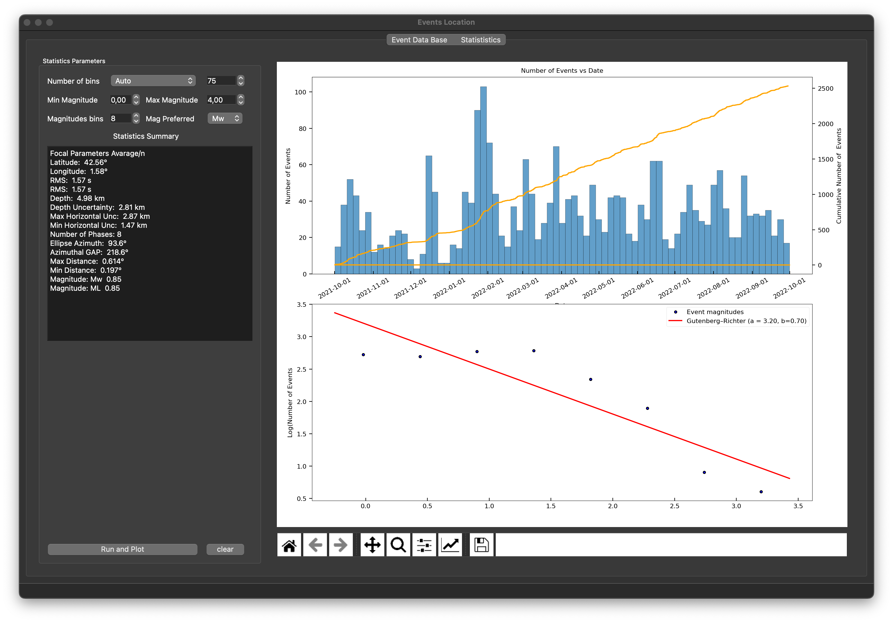

# **DataBase**

## **Populate**

- Pick in File/Read Hyp Folder to incorporate all information contained inside hyp folders. Hyp folders are the file output from location.
- Pick in File/Magnitudes to populate your database with the information from the output file obtained in source toolbox.
- Pick in File/MTI to populate your database with the information from the output file obtained in MTI toolbox.

## **Queryng**

Choose the options on the left widget to filter the hypocenter inside your DataBase. The eartquakes shown in the table can be used in the MTI GUI when runs the inversion.

## **Phase Information**

Click with right button to get the phases information corresponding to the selected event

## **Visual Options**

Double Clik near an epicenter in the map and it will be hilighted the corresponding row in the table.

Double Click in a epicenter in the table and (if here is MTI information) it will be plot the beachball in the map

Click with right button in a table row and select highlight event to visualize the exact event in the map.

