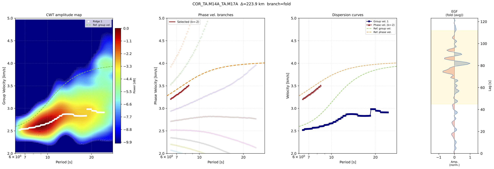
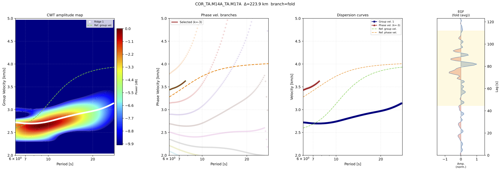

# Dispersion Curves Processing

Dispersion Curves Processing in SurfQuake estimates surface-wave group and phase velocity dispersion curves mainly from Empirical Green's Functions (EGFs) produced by the Ambient Noise Tomography workflow, or from earthquake seismograms in SAC/H5 format. Moreover, can manually create an origin-station event record, but it have to be symethic from the central sample.

The module is exposed through the `cwt_aftan` command and implements an automatic Frequency-Time Analysis workflow. It can use a Complex Morlet Continuous Wavelet Transform (CWT) or the original AFTAN-style filter bank to extract group velocity ridges, estimate phase velocity branches, optionally apply a phase-match filter, and export dispersion tables and diagnostic plots.

The general workflow is:

  1. Select the EGF branch: `fold`, `causal`, or `acausal`
  2. Optionally apply a phase-match filter using a reference model
  3. Compute the time-frequency representation with Morlet CWT or AFTAN filters
  4. Extract group-velocity ridges
  5. Apply AFTAN-style jump correction
  6. Estimate phase velocity branches
  7. Save `.grp.disp`, `.phv.disp`, and optional PDF plots

The command is especially useful after running `ant_cross_stack`, because the stacked EGFs stored in HDF5 format can be processed directly.

    References

    Herrmann, R. B. Computer programs in seismology: An evolving tool for instruction and research. Seismological Research Letters, 2013, vol. 84, no. 6, p. 1081-1088.

    Thanks bob!
* * *

# CWT-AFTAN CLI

This command measures surface-wave dispersion from EGFs or earthquake seismograms.

The default method uses Complex Morlet wavelets to build a frequency-time map and extract group velocity from the maximum energy ridge. The command can also run the AFTAN filter-bank approach with `--wavelet aftan`.

## Usage

    >> surfquake cwt_aftan -i [input_path] -o [output_path]

## Interactive help

    >> surfquake cwt_aftan -h

## Key Arguments

    -i,  --input              [REQUIRED] Input folder with H5 EGFs or a single H5/SAC file
    -o,  --output             [REQUIRED] Output folder for dispersion tables and plots
    --pattern                 [OPTIONAL] Glob pattern for folder mode (default: *.H5)

    --tmin                    [OPTIONAL] Minimum period in seconds (default: 5.0)
    --tmax                    [OPTIONAL] Maximum period in seconds (default: 150.0)
    --vmin                    [OPTIONAL] Minimum group velocity in km/s (default: 2.0)
    --vmax                    [OPTIONAL] Maximum group velocity in km/s (default: 5.0)

    --wavelet                 [OPTIONAL] Filter bank: morlet or aftan (default: morlet)
    --nf                      [OPTIONAL] Number of log-spaced frequencies (default: 100)
    --w                       [OPTIONAL] Morlet wavelet cycles (default: 6.0)
    --ffact                   [OPTIONAL] AFTAN filter width factor (default: 0.2)

    --branch                  [OPTIONAL] EGF branch: fold, causal, or acausal (default: fold)
    --source_type             [OPTIONAL] Source type: egf or earthquake (default: egf)

    --min_db                  [OPTIONAL] dB floor used for display and ridge picking (default: -25.0)
    --min_dist_kms            [OPTIONAL] Minimum separation between ridge peaks in km/s (default: 0.5)
    --num_ridges              [OPTIONAL] Number of ridges to extract (default: 3)
    --ref_tolerance_kms       [OPTIONAL] Maximum distance from reference velocity for ridge acceptance (default: 0.5)

    --ref                     [OPTIONAL] Reference model name or CSV file (see section reference models for more details)
    --wave                    [OPTIONAL] Surface wave type: rayleigh or love
    --use_pmf                 [OPTIONAL] Apply phase-match filtering; requires --ref
    --filter_param            [OPTIONAL] Phase-match Gaussian window width in seconds (default: 15.0)

    --tresh                   [OPTIONAL] Jump detection threshold for group velocity cleaning (default: 3.0)
    --npoints                 [OPTIONAL] Maximum correctable jump length in periods (default: 5)

    --n_branches              [OPTIONAL] Number of 2π phase-velocity branches (default: 10)
    --force_dist_km           [OPTIONAL] Override distance from waveform headers
    --plot                    [OPTIONAL] Save a PDF frequency-time map and dispersion plot

## Output files

For each input file, SurfQuake writes:

    *.grp.disp     Group velocity dispersion table
    *.phv.disp     Phase velocity branches table
    *.pdf          Diagnostic plot, only when --plot is used

The group velocity file contains period, group velocity and ridge power:

    # Period_s    GroupVel_kms    Power_dB

The phase velocity file contains all valid phase branches:

    # Period_s        k       PhaseVel_kms

* * *

# Reference Curves

Surface-wave dispersion images may contain:

  * multiple modes
  * interfering arrivals
  * noise-generated ridges
  * branch ambiguities
  * weak signal energy at long periods

A reference dispersion curve provides an expected phase velocity trend as a function of period. SurfQuake uses this information to:

  1. Select physically realistic ridges
  2. Reject spurious energy maxima
  3. Stabilize phase velocity branch selection
  4. Build phase-match filters
  5. Improve automatic processing in noisy datasets

Without a reference model, automatic ridge extraction can become unstable, especially for long-period or low-SNR measurements.


Built-in models are loaded with --ref. Available shorthand names include:

```
    ak135_earth
    ak135_earth_first
    ak135_ocean_deep
    ak135_ocean_deep_first
    ak135_ocean_intermediate
    ak135_ocean_intermediate_first
    ak135_ocean_shallow
    ak135_ocean_shallow_first
```

Users may also pass a full path to a custom CSV/TXT file, with columns comma separated:
```
    period,phase_velocity_rayleigh,phase_velocity_love,group_velocity_rayleigh,group_velocity_love
    1.0,3.1425,3.2721,1.6231,3.0846
    1.1,3.3333,3.2941,2.6703,3.0435
    1.2,3.3896,3.3214,2.8773,2.9913
```

* * *

# Examples CLI

## Process all stacked EGFs in a folder

    >> surfquake cwt_aftan -i ./output/stacks/ -o ./output/dispersion/ --pattern "*.H5" --plot

## Process a period and velocity window

    >> surfquake cwt_aftan -i ./output/stacks/ -o ./output/dispersion/ \
    --tmin 5 --tmax 80 --vmin 2.0 --vmax 5.0 --plot

## Use a reference model

A reference model helps guide ridge picking and enables more stable phase velocity estimation.

    >> surfquake cwt_aftan -i ./output/stacks/ -o ./output/dispersion/ \
    --tmin 5 --tmax 80 --vmin 2.0 --vmax 5.0 \
    --ref ak135_earth --wave rayleigh --plot

## Apply phase-match filtering

The phase-match filter is useful for isolating the fundamental mode before extracting the dispersion curve. It requires a reference model.

    >> surfquake cwt_aftan -i ./output/stacks/ -o ./output/dispersion/ \
    --tmin 5 --tmax 80 --vmin 2.0 --vmax 5.0 \
    --ref ak135_earth --wave rayleigh \
    --use_pmf --filter_param 15.0 --plot

## Process only the causal branch

    >> surfquake cwt_aftan -i ./output/stacks/ -o ./output/dispersion/ \
    --branch causal --tmin 10 --tmax 40 --plot

## Process a single file

    >> surfquake cwt_aftan -i ./event.SAC -o ./output/dispersion/ \
    --source_type earthquake --plot

## Use the original AFTAN filter bank

    >> surfquake cwt_aftan -i ./output/stacks/ -o ./output/dispersion/ \
    --wavelet aftan --ffact 0.20 --ref ak135_earth --plot

## Compare Morlet CWT and AFTAN

    >> surfquake cwt_aftan -i ./data/ -o ./output/morlet/ \
    --tmin 6 --tmax 28 --vmin 2.0 --vmax 5.0 \
    --ref_tolerance_kms 1.0 --min_db -10.0 \
    --wavelet morlet --num_ridges 1 --ref ak135_earth --plot


---

    >> surfquake cwt_aftan -i ./data/ -o ./output/aftan/ \
    --tmin 6 --tmax 28 --vmin 2.0 --vmax 5.0 \
    --ref_tolerance_kms 1.0 --min_db -10.0 \
    --wavelet aftan --ffact 0.20 --num_ridges 1 --ref ak135_earth --plot


---

* * *

# Recommended workflow after Ambient Noise Processing

After creating cross-correlations and stacks:

    >> surfquake ant_create_dict -d ./mseed -i ./meta/inventory.xml -s ./output/data_dict.pkl
    >> surfquake ant_process_matrix -c config_process_matrix.json
    >> surfquake ant_cross_stack -c config_cross_stack.json

run dispersion processing on the resulting stacks:

    >> surfquake cwt_aftan -i ./output/stacks/ -o ./output/dispersion/ \
    --pattern "*.H5" --tmin 5 --tmax 80 --vmin 2.0 --vmax 5.0 \
    --ref ak135_earth --use_pmf --plot

The resulting `.grp.disp` files can be used as group velocity measurements, while `.phv.disp` contains the possible phase velocity branches for each period.

* * *

# Practical notes

  1. Use `--branch fold` for standard EGFs when causal and acausal branches are both reliable.
  2. Use `--branch causal` or `--branch acausal` when one side of the EGF is cleaner.
  3. Use `--ref` when the ridge is weak, multimodal, or noisy.
  4. Use `--use_pmf` only with a suitable phase velocity reference model.
  5. Decrease `--min_db` to include weaker arrivals; increase it to make ridge picking stricter.
  6. Tune `--tresh` if jump correction is too aggressive or too permissive.
  7. Use `--force_dist_km` when the waveform header does not contain a valid inter-station distance.
