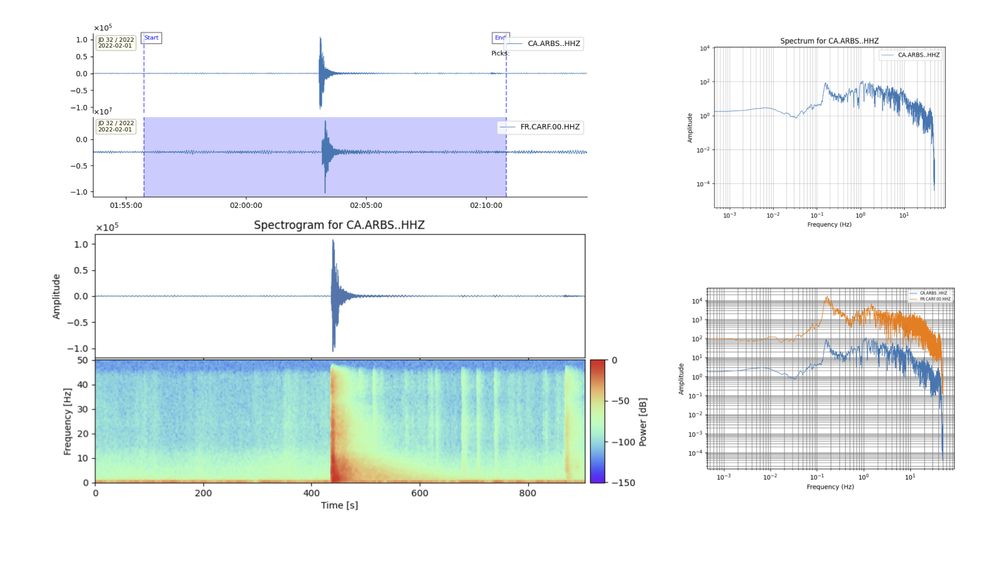
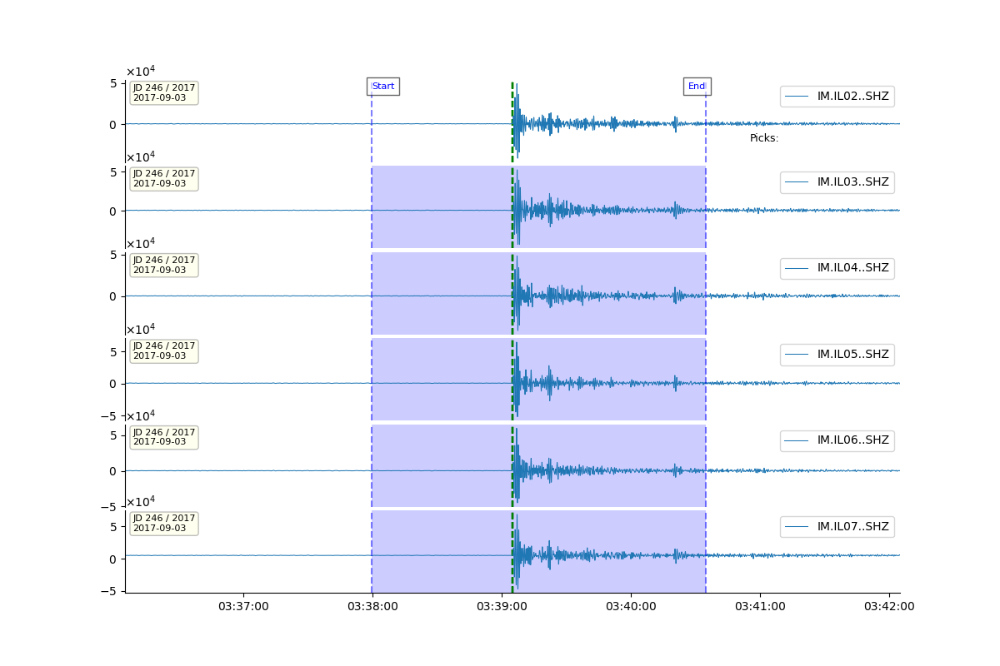
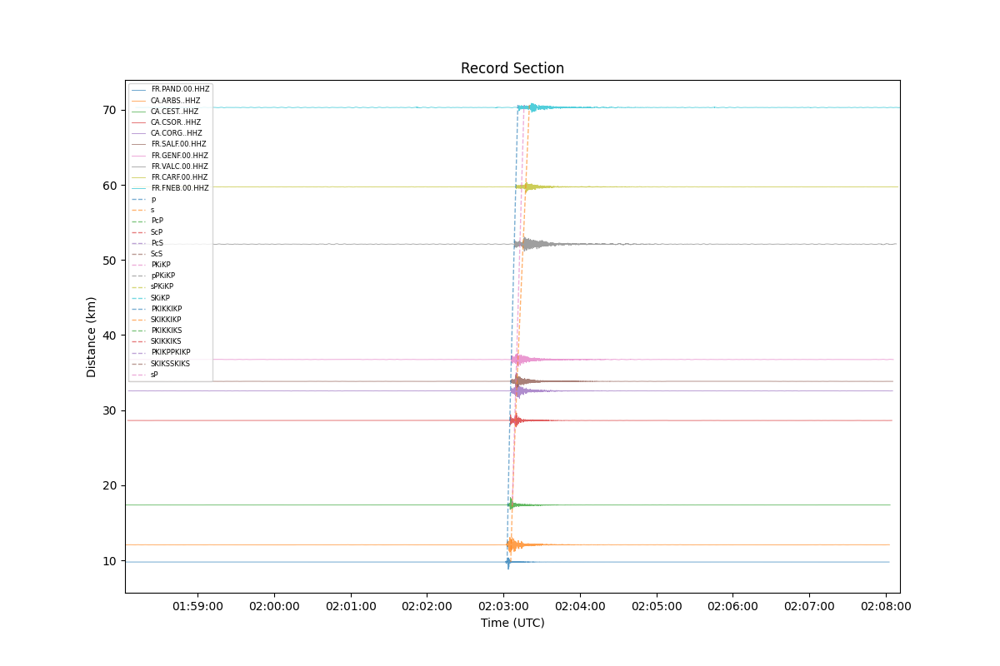

## Example 1: Using quick

This example shows how to basically use  `surfquake quick` for waveform processing and visualization.


## Bash Command Example

```bash

# File paths can be absolute or relative

# reading a simple file
surfquake quick -w "/Users/admin/surf_test/carf220201000000.hhz"

# reading more than one file. It is a list of comma seprataed paths
surfquake quick -w "/Users/admin/surf_test/carf220201000000.hhz,/Users/admin/surf_test/arbs220201000000.hhz"

# Using wildcards. In the example will read all files inside the folder
surfquake quick -w "/Users/admin/surf_test/data/*"

```

Let's work with two seismograms.

After running the command  `surfquake quick -w ... ` both seismograms are plot on screen. I zoomed in the main event and then I clicked with right button over the first seismogram to select the starttime and I draged to the right to select the endtime. After this operation, I pressed the keyboard `v` to activate the prompt in the terminal. Over the terminal, I proceed first to cut the seismograms and plotting the spectrum of the first seismogram. Then, I pressed `esc` to re-activate the prompt. Then, I plot both spectrums and finally I plot the spectrogram. Finally I returned to picking mode. This are the actions I took in the terminal propt:


```bash
>> cut
>> sp 0
>> spec all
>> spec 0
>> help spectrogram
>> spec 0 3.0 95
>> p
```



If users want processing with no vilualization use the `-a` option and set and `-o` to set an output folder. This idea was designed to automatically process data. Be in mind that you can proceed using commands inside a bash script. Moreover might be useful to set your plotting configuration first `--plot_config`.

---


## Example 2: Using a Post-Script with SurfQuake

This example demonstrates how to use a custom Python post-processing script with `surfquake quick` for waveform processing and visualization.

## Introduction

You can enhance your SurfQuake processing by injecting a custom Python script into the workflow using the `--post_script` option. This allows advanced users to modify waveform data, inject metadata, or apply event-specific logic dynamically.

---

## Bash Command Example

```bash
surfquake quick \
    -w "/Users/admin/Desktop/surf_test/nuclear/cut_event/*" \
    --post_script /Users/admin/surf_test/my_script.py \
    -c /Users/admin/surf_test/config.yaml \
    -i /Users/admin/surf_test/metadata/metadata.xml
```

---

## Example Output

You can visualize the waveform data as output from this processing command. An example of what the output looks like is shown below:
> Ensure you have your plotting configuration (`--plot_config`) properly set to produce visual output. In this example is shown the default plotting config.
> Drag with the right mouse from left to right to set the starttime and endtime. Thsi enable cut wavefrom or plot spectrogram from plotting commands, pressing `v`.



---

## The Post-Processing Script

This is the contents of the user-defined `my_script.py`:

```python
import numpy as np

def run(stream, inventory, **kwargs):
    """
    User-defined post-processing hook for each event.
    :param stream: obspy Stream
    :param inventory: obspy Inventory (passed via kwargs)
    :param event: dict with keys like origin_time, latitude, longitude, depth (passed via kwargs)
    """

    inventory = kwargs.pop('inventory', None)
    event = kwargs.pop('event', None)

    if event is not None:
        print(f"Post-processing {len(stream)} traces from event at {event['origin_time']}")
    else:
        print(f"Post-processing {len(stream)} traces (no event info provided)")

    # Example: print mean of all traces
    all_data = np.hstack([tr.data for tr in stream])
    print("Mean amplitude:", np.mean(all_data))

    for tr in stream:
        tr.data = np.diff(tr.data)

    return stream
```

---

## Explanation

This script will:

1. Print metadata about the event (if available).
2. Concatenate all trace data and print the mean amplitude.
3. Apply a numerical difference (`np.diff`) to each trace in the stream.

Such post-scripts are ideal for user-specific filtering, header modification, or transforming waveform data before further analysis or plotting.

You can insert this script into **any SurfQuake mode** that accepts `--post_script`, including `quick`, `processing`, or daily batch modes.

---

## Tips

- Always return the modified `stream`.
- You can access additional metadata via `kwargs` (like `event`, `inventory`, etc.).
- You can also modify trace headers using `tr.stats.<attribute>` if needed.

---

SurfQuake’s post-script interface allows flexible and programmable interaction with seismic datasets. Great for prototyping, automation, or embedding research logic!

---

## Example 3: Standard Events Processing

This example demonstrates how to use `surfquake processing` to perform batch waveform analysis and visualization using event metadata, inventory files, and configuration settings.

```bash
surfquake processing \
    -p /Users/admin/surf_test/project.pkl \
    -i /Users/admin/surf_test/metadata/inv_all.xml \
    -e /Users/admin/surf_test/events/events.csv \
    --plot_config /Users/admin/surf_test/config/plotting_config.yaml \
    -ch HHZ \
    -c /Users/admin/surf_test/config/config.yaml
```

Also, we can cut waveforms around the origin time of the events set in `picks.csv`, usinf  `-r ref`. This is nice if we want to chop waveforms around specific time windows. Remember `picks.csv` have the same structure as `events.csv` and there is no need to set the columns lat, long...

```bash
surfquake processing \
    -p /Users/admin/surf_test/project.pkl \
    -c /Users/admin/surf_test/config.yaml \
    -e /Users/admin/surf_test/events/events.csv \
    -s CARF -ch HHZ -t 60 -r ref
```


Alternatively, we can cut waveforms according a specific wave speed. For example, very useful for cutting surface waves.

```bash
surfquake processing \
    -p /Users/admin/surf_test/project.pkl \
    -e /Users/admin/surf_test/events/picks.csv \
    --vel 4.5 \
    --cut_start_time 5 \
    --cut_end_time 25
```

---

### Explanation

- `-p`: Path to a previously saved project file (used for loading existing data).
- `-i`: Inventory metadata file (StationXML or RESP).
- `-e`: CSV file with event origin time and focal parameters, if -r ref option is inlcuded, only set otigin time is required.
- `--plot_config`: YAML file defining how traces are plotted.
- `-s`: Select only specific station (e.g., -ch HHN,HHZ). Comma separated list. Valid if a project loaded
- `-ch`: Select only specific channels (e.g., -s ARNO). Comma separated list. Valid if a project loaded
- `-c`: YAML config file specifying processing pipeline (filtering, tapering, etc.).

This method cuts traces based on a specified group velocity (useful for surface wave analysis).

- `--vel`: Surface wave velocity (km/s) used to calculate expected arrival time.
- `--cut_start_time`: Seconds before the expected arrival.
- `--cut_end_time`: Seconds after the expected arrival.

---

## Sample `events.csv` Format

```
date;hour;latitude;longitude;depth;magnitude
2022-02-01;02:02:58.9;42.5102;1.4284;20.9;3.66
2022-02-02;23:35:29.7;42.5089;1.4293;20.7;1.71
2022-02-03;12:01:21.6;42.3047;2.2741;0.0;1.65
```

---

## Sample Plot Configuration (`plotting_config.yaml`)

```yaml
plotting:
  traces_per_fig: 3 # default 6
  sort_by: distance            # options: 'distance', 'backazimuth', or null
  vspace: 0.05                 # vertical space between subplots
  show_legend: true
  title_fontsize: 9
  plot_type: record         # 'standard', 'record' for record section and overlay for all traces at the same plot 
  sharey: False
  show_arrivals: False
  pick_output_file: ./picks.csv # picks will be written here
  auto_load_pick_file: False   # if user wants that picking file is automatically loaded and plot
  show_info_picks: False # show pick info on screen interactively
  backend: TkAgg # TkAgg (maximum robustness, default), MacOSX (only for mac), Qt5Agg (fast, picking  & interactive commands raise problems)
```

---

## Sample Processing Configuration (`config.yaml`)

```yaml
Analysis:
  process_1:
    name: 'rmean'
    method: 'linear'
  process_2:
    name: 'taper'
    method: 'cosine'
    max_percentage: 0.05
  process_3:
    name: 'filter'
    type: 'bandpass'
    fmin: 0.5
    fmax: 5.5
    corners: 4
    zerophase: True
```

This processing pipeline:
1. Removes the mean.
2. Applies a cosine taper.
3. Applies a zero-phase bandpass filter (0.5–5.5 Hz).

---

## Output

- Figures are plotted interactively unless `automatic` is enabled: surfquake processing -a and it is set and `-o` to set an output folder.
- Processed traces can be exported in `.h5` format.
- Cuts are based on the first teoretical arrival time metadata (`events.csv`) or selected method (`--vel`, `-r`, etc.).


plot_type: standard


plot_type: record



