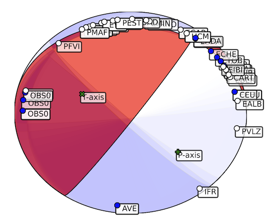

# <span style="color:darkcyan;">**Overview**</span>

FocMec is a core library that includes several tools. Each of this tools can be run from the CLI or yo can call them from your python script.

- Automatic first motion polarity determination
- Focal mecanism estimation
- Plotting tools

References:
```
    Chakraborty, M., Cartaya, C. Q., Li, W., Faber, J., Rümpker, G., Stoecker, H., & Srivastava, N. (2022). 
    PolarCAP–A deep learning approach for first motion polarity classification of earthquake waveforms. 
    Artificial Intelligence in Geosciences, 3, 46-52.

    Snoke, J. A. (2003). “FOCMEC: Focal Mechanism Determinations.” 
    International Handbook of Earthquake and Engineering Seismology, Part B, Academic Press, pp. 1629–1630.
    https://seiscode.iris.washington.edu/projects/focmec
```

## <span style="color:darkcyan;"> **FOCMEC from CLI** </span>

1. Automatic P-wave first motion polarity determination. The inputs are the project and the picking file in nonlinloc pick format (i.e., might be generated using command pick). Output is an edited pick file with polarities.
2. FOCal MEChanism determinations (FOCMEC) software  for determining and displaying double-couple earthquake focal mechanisms using the polarity and amplitude ratios of P and S waves.
3. Plot fault planes, T & P axis, and P-wave polarities.

### Usage
```bash
surfquake polarity
# Determines Polarities from P-wave first motion

Key Arguments:
        -p, --project_file_path     [REQUIRED] Path to a surfquake project
        -f, --picking_file_path     [REQUIRED] Path to a picking files
        -o, --output_file_path      [REQUIRED] Path to the new picking file edited with polarities
        -t, --thresh                [OPTIONAL] Threshold for Polarity declaration

Example usage:
        > surfquake polarity -f ./nll_picks.txt -p ./project_file.pkl -o ./nll_picks_polarities.txt -t 0.95

output file "nll_picks_polarities.txt"

Station_name    Instrument  Component   P_phase_onset   P_phase_descriptor  First_Motion    Date    Hour_min    Seconds Err ErrMag  Coda_duration   Amplitude   Period
EADA   ?    HHZ  ? P      U 20150917 1512 31.9770 GAU 7.00e-02 -1.0 6.23e+07 -1.0
ETOB   ?    HHZ  ? P      U 20150917 1513 00.3900 GAU 2.00e-02 -1.0 1.64e+08 -1.0
ETOB   ?    HHZ  ? S      ? 20150917 1513 56.3200 GAU 5.00e-01 -1.0 8.22e+07 -1.0
CEU    ?    HHZ  ? P      U 20150917 1512 08.3600 GAU 2.00e-02 -1.0 1.82e+08 -1.0
```

```bash
surfquake focmec
# Focal Mechanism from P-Wave first motion polarity

Key Arguments:
        -d, --hyp_folder        [REQUIRED] Path to folder containing hyp files
        -o, --output_folder     [REQUIRED] Path to the output folder
        -a, --accepted          [OPTIONAL] Number of accepted wrong polarities (float, default 1.0)

Example usage:
        > surfquake focmec -h # Interactive help
        > surfquake focmec -d ./folder_hyp_path -a 1.0 -o ./output_folder

```

```bash
surfquake plotmec
# Plot fault planes, T & P axis, and P-wave polarities

Key Arguments:
        -f, --focmec_file           [OPTIONAL] Path to a specific *.lst file
        -d, --focmec_folder_path    [OPTIONAL] Path to folder with all *.lst files (focmec output)
        -o, --output_folder         [REQUIRED] Path to the output folder
        -a, --all_solutions         [OPTIONAL] If set, all searching fault planes will be plot
        -p, --plot_polarities       [OPTIONAL] If plot P-Wave polarities on the beachball
        -m, --format                [OPTIONAL] Format output plot (defaults pdf)

Example usage:
        > surfquake plotmec -h # Interactive help
        > surfquake plotmec -d ./focmec_folder_path -o ./output_folder
        > surfquake plotmec -f ./focmec_file_path.lst -o ./output_folder -p -a -m pdf 
```

Output plot example



## <span style="color:darkcyan;"> **Focmec from library** </span>

### Classes & Methods
In this section, we will explain the class RunPolarity and we will explain how to manage your project from a simple example:

[`RunPolarity`](https://github.com/rcabdia/SurfQuakeCore/blob/main/surfquakecore/first_polarity/get_pol.py)


```python 
class RunPolarity:

    def __init__(self, project, pick_file:str, output_path:str, threshold=0.9):
        """
        Attributes:
        - project (SurfProject): SurfProject object
        - pick_file (str): path to picking file
        - output_path (str): path to output_path
        Methods
        - send_polarities(self): Run automatic determination
        """
```

```python 
class FirstPolarity:

    def __init__(self):
        """
        Manage FOCMEC files for run nll program.

        Important: The  obs_file_path is provide by the class :class:`PickerManager`.

        Methods:

        find_hyp_files: 
        return list of hyp_files
        
        set_head(hyp_file_path): staticmethod, helps to set a string in comments of focmec input, check that input file is valid. 
        return header
         
        create_input(self, hyp_file_path, header): creates the focmec input from a hyp_file. return path to the input file
        
        check_no_empty(input_file): staticmethod, check that the input file has been created correctly.
        
        run_focmec(self, input_focmec_path, num_wrong_polatities, new_output_path=None): Run focal mechanism estimation and write the 

        output in folder new_output_path
        """
```

```python 
class FirstPolarity:

    def __init__(self):
        """
        Manage FOCMEC files for run nll program.

        Important: The  obs_file_path is provide by the class :class:`PickerManager`.

        Methods:

        find_hyp_files: 
        return list of hyp_files
        
        set_head(hyp_file_path): staticmethod, helps to set a string in comments of focmec input, check that input file is valid. 
        return header
         
        create_input(self, hyp_file_path, header): creates the focmec input from a hyp_file. return path to the input file
        
        check_no_empty(input_file): staticmethod, check that the input file has been created correctly.
        
        run_focmec(self, input_focmec_path, num_wrong_polatities, new_output_path=None): Run focal mechanism estimation and write the 

        output in folder new_output_path
        """
```

## <span style="color:darkcyan;"> **Examples Scripts** </span>

Next, the example of using this class and its methods.

### Script for automatic polarities determination

```python linenums="1"

from multiprocessing import freeze_support
from surfquakecore.project.surf_project import SurfProject
from surfquakecore.first_polarity.get_pol import RunPolarity

project_file = "/Volumes/LaCie/test_surfquake_core/testing_data/projects/surfquake_project_new.pkl"
picking_file = "/Volumes/LaCie/test_surfquake_core/testing_data/picking_file.txt"
output_file = "/Volumes/LaCie/test_surfquake_core/testing_data/picking_file_polarities.txt"
threshold = 1.0

if __name__ == '__main__':

    project = SurfProject.load_project(project_file)
    RunPolarity(project, picking_file, output_file, threshold).send_polarities()

```


### Script for running focmec


```python linenums="1"

from multiprocessing import freeze_support
from surfquakecore.first_polarity.first_polarity import FirstPolarity

hyp_folder = "/Volumes/LaCie/test_surfquake_core/testing_data/loc"
output_folder = "/Volumes/LaCie/test_surfquake_core/testing_data/output_focmec"
accepted_polarities = 1.0

if __name__ == '__main__':

    files_list = FirstPolarity.find_hyp_files(hyp_folder)
    for file in files_list:
        try:
            header = FirstPolarity.set_head(file)
            if file is not None:
                file_input = FirstPolarity().create_input(file, header)

                if FirstPolarity.check_no_empty(file_input):
                    FirstPolarity().run_focmec(file_input, accepted_polarities, output_folder)
        except Exception as e:
            print(f"Error processing file {file}: {e}")
            traceback.print_exc()

```


### Script for plotting focal mechanisms


```python linenums="1"


focmec_file = "/Volumes/LaCie/test_surfquake_core/testing_data/output_focmec" # extension of focmec output is *.lst
output_folder = "Volumes/LaCie/test_surfquake_core/testing_data/beachballs"

if __name__ == '__main__':
    
    firstpolarity_manager = FirstPolarity()

    focmec_files = firstpolarity_manager.find_files(focmec_folder_path)

    for file in focmec_files:

        Station, Az, Dip, Motion = FirstPolarity.extract_station_data(file)
        cat, focal_mechanism = firstpolarity_manager.extract_focmec_info(file)
        file_output_name = FirstPolarity.extract_name(file)

        if output_folder:
            name_str = os.path.basename(file)[:-3] + format
            output_folder_file = os.path.join(output_folder, name_str)
        else:
            output_folder_file = None

        Plane_A = focal_mechanism.nodal_planes.nodal_plane_1
        strike_A = Plane_A.strike
        dip_A = Plane_A.dip
        rake_A = Plane_A.rake
        extra_info = firstpolarity_manager.parse_solution_block(focal_mechanism.comments[0]["text"])
        P_Trend = extra_info['P,T']['Trend']
        P_Plunge = extra_info['P,T']['Plunge']
        T_Trend = extra_info['P,N']['Trend']
        T_Plunge = extra_info['P,N']['Plunge']

        misfit_first_polarity = focal_mechanism.misfit
        azimuthal_gap = focal_mechanism.azimuthal_gap
        number_of_polarities = focal_mechanism.station_polarity_count
        if all_solutions:
            solution_collection = cat[0]["focal_mechanisms"]
        else:
            solution_collection = None


        #
        first_polarity_results = {"First_Polarity": ["Strike", "Dip", "Rake", "misfit_first_polarity", "azimuthal_gap",
                                                     "number_of_polarities", "P_axis_Trend", "P_axis_Plunge",
                                                     "T_axis_Trend", "T_axis_Plunge"],
                                  "results": [strike_A, dip_A, rake_A, misfit_first_polarity, azimuthal_gap,
                                              number_of_polarities, P_Trend, P_Plunge, T_Trend, T_Plunge]}

        FirstPolarity.print_first_polarity_info(file_output_name, first_polarity_results)
        FirstPolarity.drawFocMec(strike_A, dip_A, rake_A, Station, Az, Dip, Motion, P_Trend, P_Plunge,
            T_Trend, T_Plunge, output_folder_file, plot_polarities=True,
                                 solution_collection=solution_collection)
```