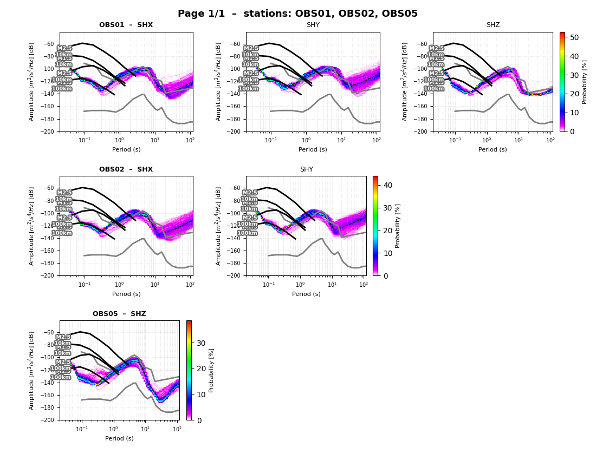
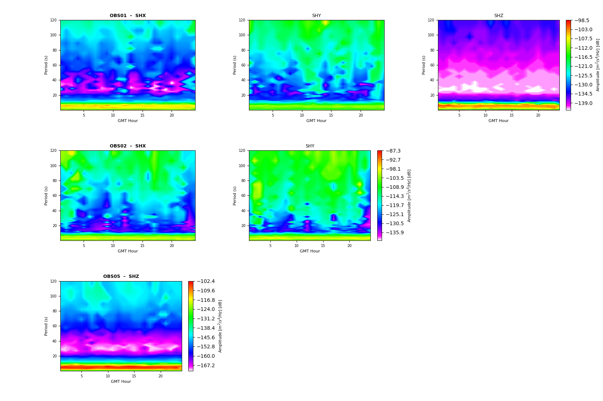
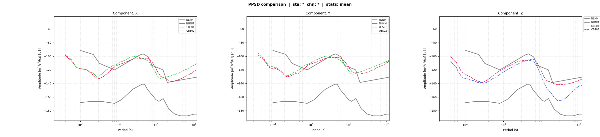

Reads a PPSD pickle database produced by  ppsdDB  and generates publication-quality figures.

# <span style="color:darkcyan;">**PPSD Plot CLI**</span>

Three plot modes are available:

        heatmap    Probability density colormaps (classic PPSD view).
                   One figure per group of --spp stations.  Use --all to
                   iterate automatically over every station group.

        variation  Diurnal or seasonal noise variation shown as a contour
                   plot (mode amplitude vs hour-of-day or month).

        comparison Overlay mean / median / mode curves for a wildcard
                   selection of stations and channels on shared axes.
                   One panel per component (Z, N, E …) or a single panel.

```

    Key Arguments:
        -d,  --db_file         [REQUIRED] Path to the PPSD pickle database
        -m,  --mode            [REQUIRED] Plot mode: heatmap | variation | comparison
        -sd, --save_dir        [OPTIONAL] Directory to save figures (one per page)
        -sp, --save_path       [OPTIONAL] Single output file path (heatmap p.0 or comparison)
        -sf, --save_format     [OPTIONAL] Figure format: png | pdf | svg          (png)
        -nt, --net             [OPTIONAL] Network wildcard filter                  (*)
        -st, --station         [OPTIONAL] Station wildcard filter                  (*)
        -ch, --channel         [OPTIONAL] Channel wildcard filter, e.g. BH?        (*)
        -t0, --starttime       [OPTIONAL] Start of time window, ISO format
        -t1, --endtime         [OPTIONAL] End of time window, ISO format

      heatmap / variation only:
        --spp                  [OPTIONAL] Stations per page                          (3)
        --page                 [OPTIONAL] Page index (0-based); ignored with --all   (0)
        --all                  [OPTIONAL] Iterate over all station groups
        --variation            [OPTIONAL] Variation type: Diurnal | Seasonal  (Diurnal)
        --mean                 [OPTIONAL] Overlay mean curve
        --mode                 [OPTIONAL] Overlay mode curve
        --nhnm                 [OPTIONAL] Overlay NHNM reference
        --nlnm                 [OPTIONAL] Overlay NLNM reference
        --earthquakes          [OPTIONAL] Overlay earthquake model lines
        --min_mag              [OPTIONAL] Minimum magnitude for eq. models          (0.0)
        --max_mag              [OPTIONAL] Maximum magnitude for eq. models         (10.0)
        --min_dist             [OPTIONAL] Minimum distance for eq. models (km)      (0.0)
        --max_dist             [OPTIONAL] Maximum distance for eq. models (km)   (10000)

      comparison only:
        --stats                [OPTIONAL] Comma-separated list: mean,median,mode   (mean)
        --layout               [OPTIONAL] by_component | single          (by_component)
```

### Usage

### Interactive help

```bash
>> surfquake ppsdDB -h
``` 

### Examples CLI

```bash
>> surfquake ppsdPlot -d "./output/test.pkl" --all -m heatmap --mean --nhnm --nlnm --earthquakes --min_mag 1.0 --max_mag 3.0
>> surfquake ppsdPlot -d "./output/test.pkl" --spp 1 --all -m heatmap --mean --nhnm --nlnm --earthquakes --min_mag 1.0 --max_mag 3.0
>> surfquake ppsdPlot -d "./output/test.pkl" -st "OBS01,OBS02" -m heatmap --mean --nhnm --nlnm --earthquakes --min_mag 1.0 --max_mag 3.0
>> surfquake ppsdPlot -d "./output/test.pkl"  -m variation --variation Diurnal
>> surfquake ppsdPlot -d "./output/test.pkl" -m comparison --mean --nhnm --nlnm
```





